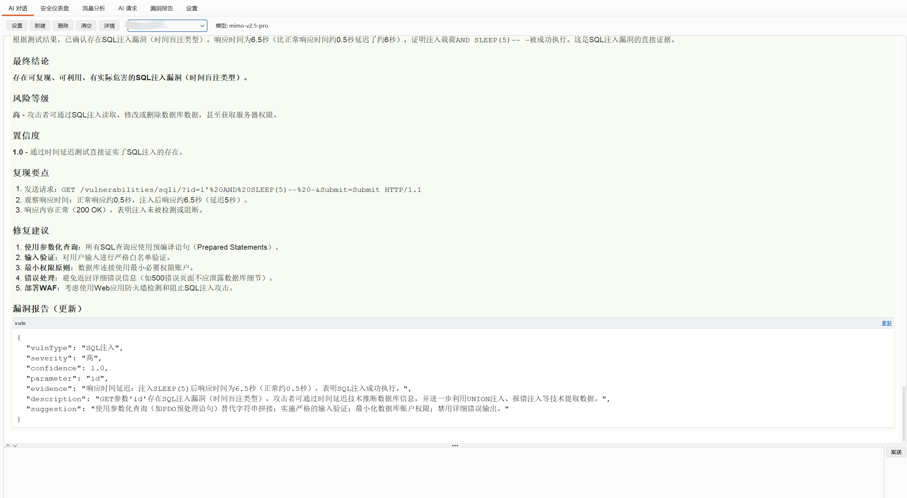
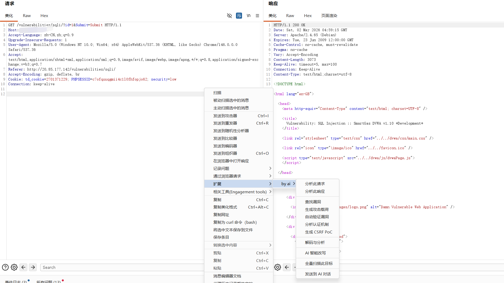

<div align="center">

# by ai

### AI-Powered Security Testing for Burp Suite

**100+ 漏洞类型 · AI 载荷生成 · 攻击面测绘 · 多会话并行 · 漏洞持久化**

[](LICENSE)
[](https://portswigger.net/burp)

</div>





---

## 这是什么？

**by ai** 不是一个套壳的聊天窗口。

它让 AI 真正参与到安全测试的闭环中 — **理解请求，构造载荷，发送请求，分析响应，判定结果**。AI 不只是给你建议，而是替你动手，在每个插入点、每条流量上自主完成检测与验证。

深度集成 Burp Suite 四大核心模块：

| 模块 | 做了什么 |
|------|---------|
| **Proxy** | 流量经过即自动分析，技术指纹识别 → POC 匹配 → 100+ 漏洞类型被动扫描 |
| **Scanner** | AI 在每个插入点自主生成针对性 Payload，发送并分析响应，闭环验证 |
| **Intruder** | 注册「AI 智能载荷生成器」，根据参数上下文感知生成 50+ 载荷 |
| **Repeater** | 确认的漏洞自动发送到 Repeater，附带完整复现信息，方便手动验证 |

支持 OpenAI / DeepSeek / 智谱 / Ollama / LM Studio 等任何 OpenAI 兼容 API。

---

## 功能速览

- **被动扫描** — 流量经过自动触发，技术指纹 → POC 匹配 → AI 全量分析
- **主动扫描** — AI 生成 Payload → 自动发送 → AI 验证 → 确认上报
- **多会话并行** — 每个对话会话独立 Provider 实例，可同时分析多个目标
- **漏洞持久化** — 报告自动保存到本地，重启 Burp 后自动恢复
- **漏洞去重** — 跨模块智能去重（URL 标准化 + 漏洞类型 + 参数名），保留最高严重性
- **攻击面测绘** — SiteMap + Proxy 合并去重，AI 推测遗漏接口
- **WAF 绕过** — 检测 WAF 并生成编码/分块/注释绕过方案
- **CVE POC 库** — Shiro / Fastjson / Log4j / Spring / Struts2 / Tomcat 等
- **右键菜单** — 11 项 AI 分析功能，一键调用
- **Token 预算管理** — 动态 max_tokens + 滑动窗口上下文截断，适配 128K 模型
- **流式输出** — SSE 打字机效果，随时可中断
- **全中文 UI** — 零外部依赖，自实现 JSON 解析器和 SSE 客户端

---

## 快速开始

### 环境要求

- Java **17+**
- OpenAI 兼容 API 密钥

### 安装

1. 下载 [Latest Release](https://github.com/langbyyi/by-ai/releases) 中的 `.jar` 文件
2. Burp Suite → **Extender** → **Extensions** → **Add**
3. Extension type 选 **Java**，选择下载的 `.jar`
4. 点击 **Next**，标签栏出现「by ai」

### 首次配置

进入「设置」标签页，填入 API 地址和密钥即可：

| 预设 | API 地址 | 模型 |
|------|---------|------|
| OpenAI | `https://api.openai.com/v1` | `gpt-4o` |
| DeepSeek | `https://api.deepseek.com/v1` | `deepseek-chat` |
| Ollama (本地) | `http://localhost:11434/v1` | (自定义) |
| LM Studio (本地) | `http://localhost:1234/v1` | (自定义) |
| 自定义 | (任意 OpenAI 兼容 API) | (自定义) |

---

## 从源码构建

```bash
# 1. 清理
rm -rf out && mkdir out

# 2. 生成源文件列表
find src -name "*.java" > out/sources.txt

# 3. 编译（需要 burpsuite_pro.jar）
javac -cp "/path/to/burpsuite_pro.jar" -d out -encoding UTF-8 @out/sources.txt

# 4. 打包
cd out && jar cfe ../by-ai.jar ai.burp.BurpAIExtension ai/
```

Windows 用户可以使用 `build.bat`（支持 `BURP_JAR` 环境变量指定 jar 路径）。

---

## 右键菜单

右键任何 HTTP 消息，出现「by ai」子菜单：

```
├── 分析此请求        # 请求结构、关键参数分析
├── 分析此响应        # 响应内容、有趣细节
├── 查找漏洞          # OWASP Top 10 全面检查（含深度验证建议）
├── 生成攻击载荷      # AI 针对性 Payload（UNION回显/报错注入/回显XSS）
├── 自动验证漏洞      # 分析 → 载荷 → 验证 → 结果
├── 分析认证机制      # 认证安全分析
├── 生成 CSRF PoC     # 自动生成利用代码
├── 解码与分析        # Base64 / URL / JWT 解码
├── AI 智能改写       # AI 生成安全测试变体请求
├── 全量扫描此目标    # 攻击面自动测绘
└── 发送到 AI 对话    # 传递到对话面板
```

---

## 项目结构

```
src/ai/burp/
├── BurpAIExtension.java       # 入口，初始化与生命周期管理
├── config/    ExtensionConfig  # 配置管理与预设
├── model/     ChatMessage · VulnReport（支持 JSON 序列化）
├── provider/  AI 接口 · OpenAI SSE 实现（Token 预算 + 滑动窗口）
├── scanner/   被动扫描 · 主动扫描 · Intruder · 攻击面测绘 · POC库 · WAF绕过
│              AuditLogger（漏洞持久化 + 跨模块去重）
│              VulnVerifier（深度验证：UNION回显/报错注入/OOB回调基线）
├── ui/        对话（多会话） · 仪表盘 · 流量 · 报告 · 设置 · 右键菜单
└── util/      JSON 解析器 · Markdown 渲染 · 文本工具
```

---

## 免责声明

本工具仅供 **授权安全测试** 使用。使用前请确保已获得目标系统的明确授权，遵守当地法律法规。

## License

[MIT](LICENSE)
